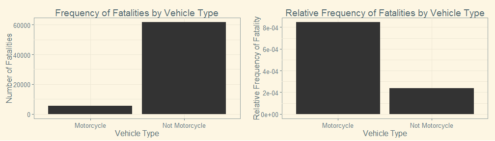
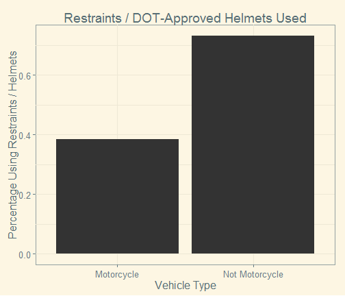
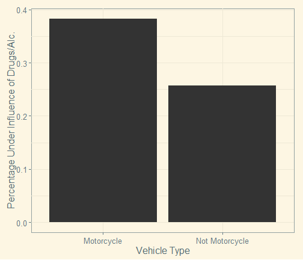
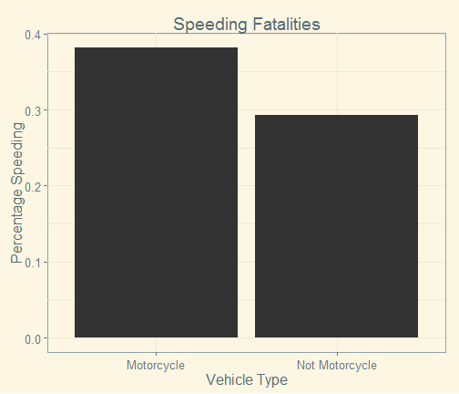
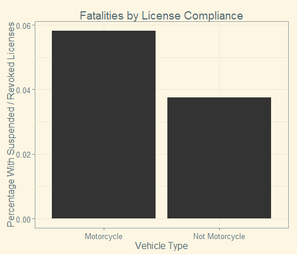
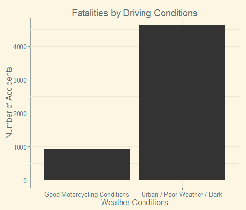
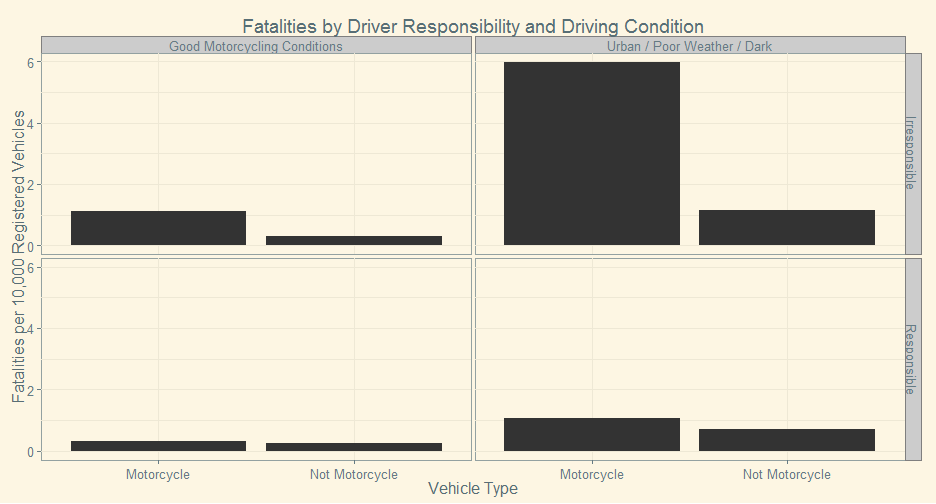

## Legend vs. Reality

- Many people believe motorcycles are much more dangeous than cars
- Undoubtedly cyclists are more exposed and harder to see
- However, cyclists are also more alert
- It's clear from traffic statistics that cyclists are disproportionately involved in fatal accidents
  - http://www-fars.nhtsa.dot.gov/
- Before we jump to conclusions about motorcycle safety, let's understand why this is

--- .class #id 

## The Data

- The National Highway Traffic Safety administration publishes a yearly data set describing fatal accidents occurring within that year
- For each accident, a number of factors are reported including weather conditions, time of day, whether safety devices were used, whether speeding or drugs were involved, etc.
- This presentation uses the 2011 data set, consisting of 67,143 accident reports

---

## A Note About Relative Frequency

- Without a doubt, there are more fatalities in accidents involving cars, trucks, and SUVs than there are involving motorcycles, so motorcycle accidents are less __frequent__
- However, there are fewer registered motorcycles on the road, so the __relative frequency__ of motor accidents is actually much higher

- So, let's get started ...

---

## Helmet / Seatbelt Use

Over 70% of 4-wheeled vehicle operators use seat belts, but less than 40% of motorcyclists wear helmets

---

## Drug and Alcohol Usage

Motorcycle accidents are almost 15% more likely to involve drugs or alcohol than other accidents

---

## Speeding

Motorcycle accidents are about 10% more likely to have speeding as a factor, as indicated by police reports

---

## Legal Motorists

Many more motorcyclists than other operators are not legally permitted to drive their vehicles, 
either because they never got a license, or it was revoked or suspended.

---

## Weather Conditions

Most motorcycle accidents occur in non-ideal motorcycle conditions, such as 
urban environments, in poor weather, or in the dark.

---

## So What?

All of these factors are under the control of the cyclist.
Let's see how things break down for a responsible cyclist 
that only rides under ideal conditions.

Responsibility Factors:
 - Always wear a helmet
 - Don't use drugs/alcohol
 - Don't speed
 - Don't ride with a revoked/suspended license

Condition Factors:
 - Don't ride in congested areas (e.g. cities)
 - Don't ride in bad weather
 - Don't ride in the dark

--- 

## Judge the Risk for Yourself

